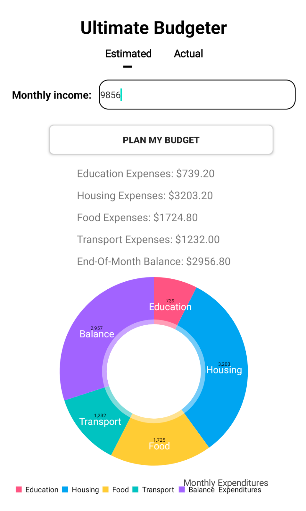
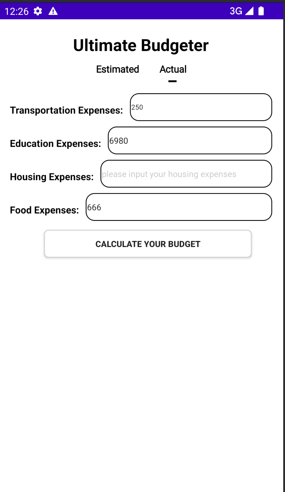
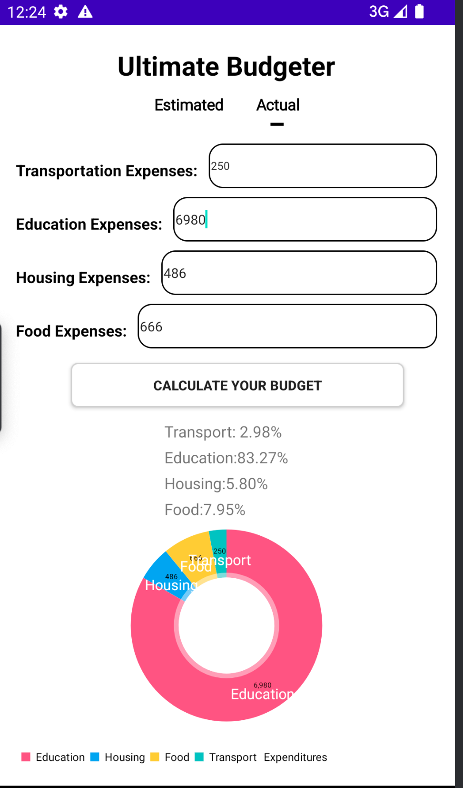

# Ultimate Budgeter - Android Application

## Overview

Ultimate Budgeter is an Android application designed to help users manage their expenses by calculating and visualizing their budget. The application allows users to input various types of expenses and then provides a graphical representation of their budget breakdown.

## Features

- **Expense Input:** Users can input their estimated and actual expenses in different categories.
- **Budget Calculation:** The app calculates the total expenses and provides a breakdown by category.
- **Visual Representation:** A pie chart displays the distribution of expenses for better understanding.

## Screenshots

### Estimated Budget Input

### Actual Budget Input with Error Handling

### Estimated Budget Result

### Actual Budget Result

## Video Demo

Check out the video demo of the Ultimate Budgeter app in action:

### Video 1: Overview and Usage

### Video 2: Error Handling and Validation

## Installation

To install the app on your Android device, clone this repository and follow the steps below:

1. Open the project in Android Studio.
2. Build and run the app on your device.

## Contributions

Contributions are welcome! Feel free to submit a pull request or open an issue if you find a bug or have a suggestion for improvement.

## License

This project is licensed under the MIT License - see the [LICENSE](LICENSE) file for details.
